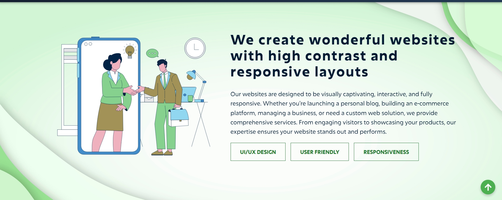
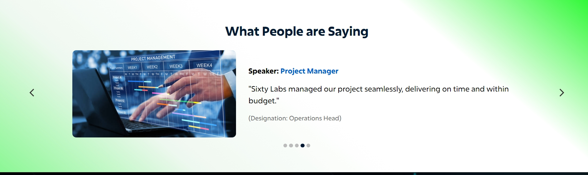
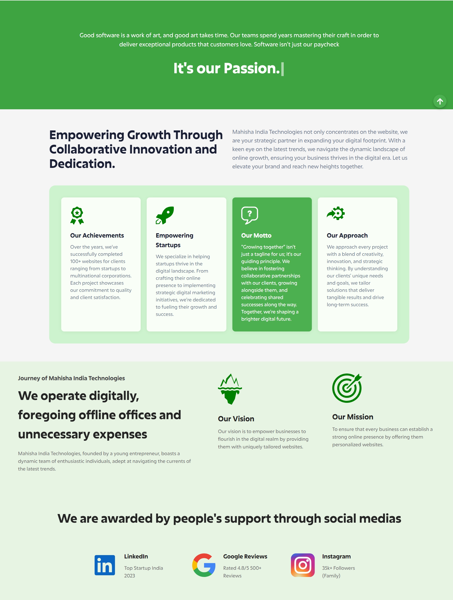
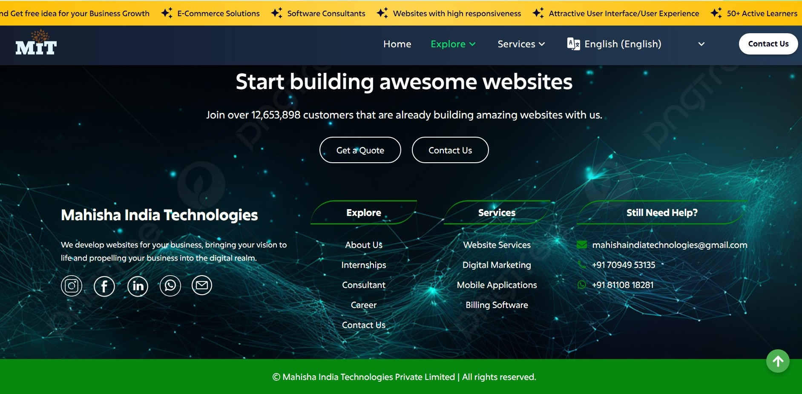
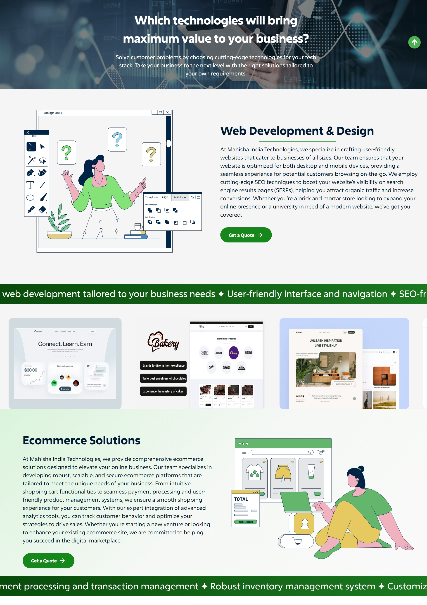
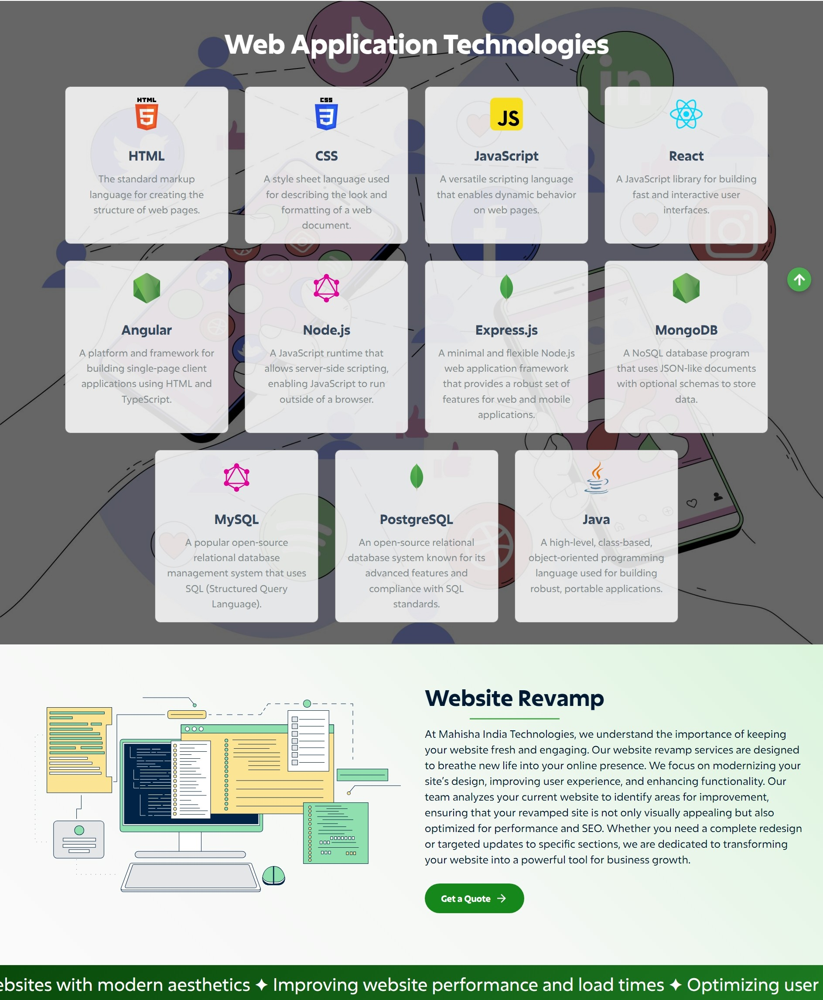
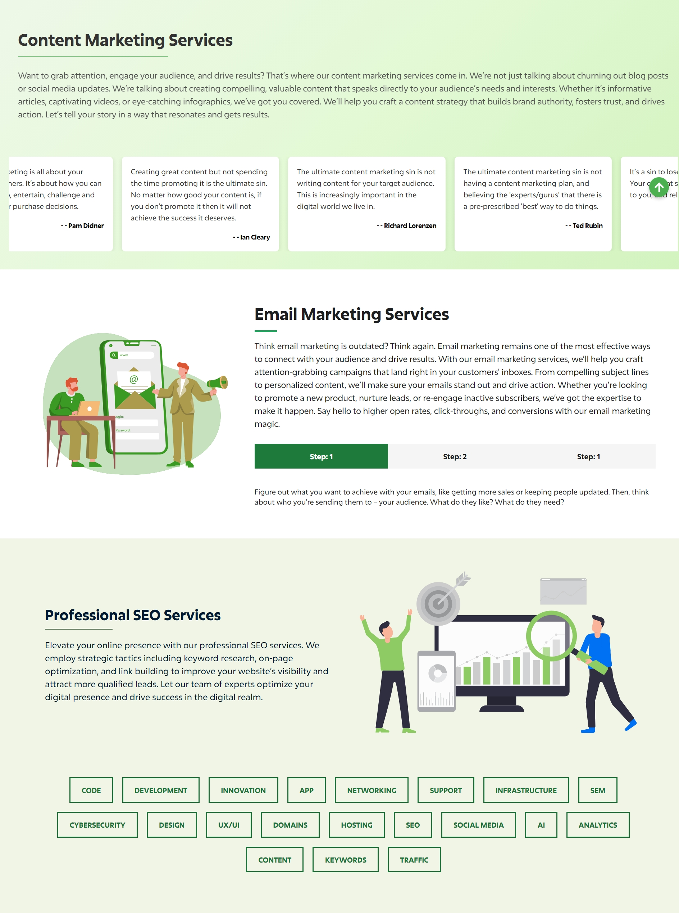

# 🚀 **MIT - Mahisha India Technologies**

Welcome to the official **Mahisha India Technologies (MIT)** website repository! 🌟 This project represents a modern, responsive, and multilingual website crafted to deliver seamless user experience and innovative design.

---

## 📚 **Project Overview**

MIT (Mahisha India Technologies) is a **dynamic and interactive website** focused on showcasing advanced web development services. With an emphasis on strong **frontend design** and a robust **backend architecture**, this project demonstrates excellence in web technology implementation.

---

## 🛠️ **Technologies Used**

### **Frontend:**
- **React** ⚛️
- **CSS** 🎨
- **Tailwind CSS** 💨
- **MUI (Material-UI) Styles** 🧩
- **AOS (Animate on Scroll)** ✨
- Node packages: Sliders, Typing Effect, and many others

### **Backend:**
- **Node.js** 🟢
- **Express.js** 🚀
- **MySQL** 🗄️
- **Sequelize (ORM)** 📊

### **Multilingual Support:**
- 9 Languages: **English, Hindi, Tamil, Telugu, Kannada, Malayalam, Japanese, Chinese, Swedish** 🌍

---

## 🌐 **Key Features**

- **✨ Responsive UI/UX:** Modern and attractive user interface with seamless animations.
- **🌍 Multilingual Support:** 9 language translations for global accessibility.
- **💻 Backend Integration:** Robust server-side architecture with database management.
- **⚡ Animations:** Smooth scroll effects, interactive components, and dynamic elements.
- **🔒 Secure and Scalable:** Built with best practices in security and scalability.

---

## 📸 **Screenshots**

(Look for the Website pages and its UI to feel better)

Example:
1. 
2. 
3. 
4. 
5. 
6. 
7. 
8. 
9. 
10. 

---

## 🚦 **How to Run the Project**

1. **Clone the Repository:**
```bash
git clone https://github.com/yourusername/Mit_Website.git
```

2. **Navigate to the Project Directory:**
```bash
cd Frontend
```

3. **Install Dependencies:**
```bash
npm install
```

4. **Run the Development Server:**
```bash
npm run dev
```

5. Open your browser and navigate to:
```
http://localhost:5173
```

---

## 📬 **Contact**
- **Developer:** Your Name
- **Email:** your.email@example.com
- **LinkedIn:** [Your LinkedIn Profile](#)
- **GitHub:** [Your GitHub Profile](#)

---

## 📜 **License**

This project is licensed under the **MIT License**.

---

⭐ *If you find this project helpful, don't forget to give it a star!* ⭐

🚀 **Happy Coding!** 🚀

---

*Developed with ❤️ by Mahisha India Technologies.*

